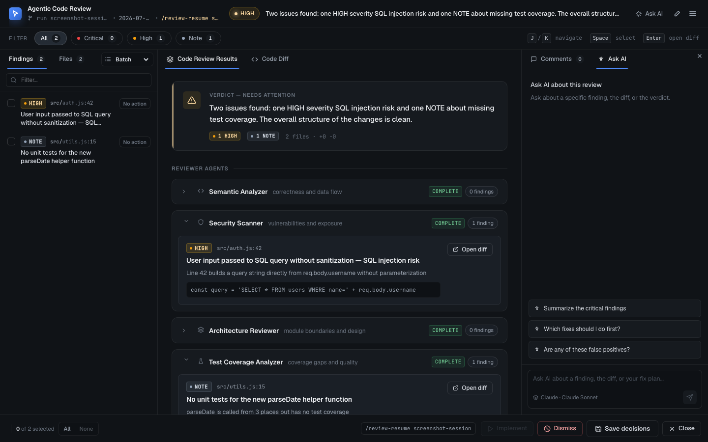

# Agentic Code Reviewer

<p align="center">
  
</p>

A portable skill that launches a background code-review run for your git diff. It starts 5 specialized reviewer processes in parallel, runs a Synthesizer pass after they finish, and opens a local web UI where you can triage findings, annotate code, save decisions, and resume the agent with deterministic follow-up instructions.

## What it does

Five specialist reviewers — semantic, security, architecture, test-coverage, senior-dev — each inspect the same filtered diff from their own angle and return structured JSON findings with confidence >=80. The Synthesizer reads the diff plus all reviewer result files, drops weak or duplicate findings, resolves contradictions, re-rates severity by actual blast radius, and writes a 2-sentence top-line verdict to `synthesis.json`.

The current runtime is process-based: `/code-review` is the intended short command and starts `scripts/orchestrator.sh`, which creates `.claude/review-runs/<run-id>/`, launches `scripts/orchestrator.py` with `nohup`, and returns after printing status. Claude Code may also show the plugin-qualified `/agentic-code-reviewer:code-review` form, but `/code-review` remains the canonical user-facing launcher. Claude Code named subagents and Codex `spawn_agent` are not used as the execution primitive.

On Claude Code and Codex there is an extra layer: a Stop hook controlled by `stopHookMode` in `~/.claude/agentic-code-reviewer/settings.json`. The default is `prompt`, including upgraded installs with older settings files. In prompt mode, the Stop hook stops the turn and asks the user to reply `yes` or `no`; a `UserPromptSubmit` hook consumes that next reply before the model sees it. Claude Code gets the hooks from the plugin manifest; Codex gets them from `~/.codex/hooks.json`. Manual invocation still works on both hosts.

## The review council

| Agent | Focus | Claude model | Codex model |
|---|---|---|---|
| `semantic-analyzer` | Logic correctness, control flow, null handling, off-by-one, race conditions | Sonnet | `gpt-5.4`, reasoning `medium` |
| `security-scanner` | OWASP Top 10, injection, secrets in code, auth/authorization gaps | Sonnet | `gpt-5.4`, reasoning `medium` |
| `architecture-reviewer` | Module boundaries, system-level SOLID, missing abstractions, YAGNI | Sonnet | `gpt-5.4`, reasoning `medium` |
| `test-coverage-analyzer` | Behavioral test gaps, missing edge cases, untested error paths | Haiku | `gpt-5.4-mini`, reasoning `low` |
| `senior-dev-reviewer` | Local DRY, naming, error handling, project conventions, dead code | Sonnet | `gpt-5.4`, reasoning `medium` |
| `synthesizer` (judge) | Dedupe, drop no-evidence findings, resolve contradictions, re-rate severity, write verdict | Opus, effort `xhigh` | `gpt-5.5`, reasoning `xhigh` |

The launcher resolves the active provider from `ACR_PLATFORM`, `--platform`, host session environment, and install path. Claude launches use `claude`; Codex launches use `codex exec`. Defaults are the `sonnet` / `haiku` / `opus` CLI aliases on Claude — these resolve to the newest model of each family in your installed CLI (currently Claude Sonnet 5, Haiku 4.5, and Opus 4.8), so reviews track model upgrades automatically — and `gpt-5.4` / `gpt-5.4-mini` / `gpt-5.5` on Codex. The judge runs at `xhigh` effort/reasoning; reviewers run at `medium` (`low` for test-coverage). Raise reviewer depth with `ACR_CLAUDE_EFFORT_BALANCED=high` (or `ACR_CODEX_REASONING_BALANCED=high`) if you prefer thoroughness over speed.

Advanced overrides:

- `ACR_REVIEW_PROVIDER=claude|codex`
- `ACR_CLAUDE_BIN=/path/to/claude`
- `ACR_CODEX_BIN=/path/to/codex`
- `ACR_MODEL_BALANCED`, `ACR_MODEL_FAST`, `ACR_MODEL_JUDGE` — override the model for each reviewer role. Must be full model IDs (e.g. `claude-haiku-4-5-20251001`, not `haiku`). Can also be set project-wide in `.acr.json` (see [Session-exit gate](#session-exit-gate)).
- `ACR_CODEX_REASONING_BALANCED`, `ACR_CODEX_REASONING_FAST`, `ACR_CODEX_REASONING_JUDGE`

## How it works

1. **Launch.** `/code-review` runs `scripts/orchestrator.sh --repo "$(pwd)"`. `/pr-review <number|URL>` adds `--pr "$ARGUMENTS"` and requires `gh`. `/review-last` reopens the most recent saved review. `/acr-config` creates or updates the repo's `.acr.json` (pause/disable the gate, models, scope).
2. **Snapshot.** The orchestrator validates required tools, creates `.claude/review-runs/<run-id>/`, captures `git diff --text HEAD` with excludes for lockfiles, minified assets, images, archives, and build directories, then writes `diff.txt` and `context.json`. PR mode uses `gh pr view` and `gh pr diff`.
3. **Fan out.** `scripts/orchestrator.py` starts 5 subprocesses through `scripts/run-reviewer.sh`. Each subprocess uses the resolved provider command against the same `diff.txt` and writes `agents/<reviewer>.json`.
4. **Synthesize.** `scripts/run-synthesizer.sh` runs after all reviewer files are present. It writes `synthesis.json`; if synthesis fails, `scripts/claude_json.py synthesis-fallback` aggregates raw reviewer findings into a fallback result.
5. **Open UI.** The compiled `dist/review-server` binary opens the review UI with `--run-dir <path>`. It reads `synthesis.json`, `context.json`, `diff.txt`, and raw reviewer files. A Node wrapper at `server/review-server.js` falls back to Bun source in development. If the VS Code extension is active, UI opens can be routed into a VS Code tab instead of an external browser.
6. **Decide and resume.** The UI writes `decisions.json` in the run directory and a compatibility `/tmp/claude-code-review-${run-id}.decision` file. `/review-resume <run-id>` reads `synthesis.json` and `decisions.json`, then prints exact implementation instructions for the agent. Manual launches also attempt host auto-resume and record a fallback `review-resume.sh` command in `auto-resume.json`.

## Platform support matrix

| Feature | Claude Code | Codex | Copilot CLI |
|---|---|---|---|
| Background process fan-out | ✅ via `claude` | ✅ via `codex exec` | ⚠ manual/untested |
| Skill invocation | `/code-review`, `/review-last` + Stop hook | skills load natively + Stop hook | manual copy/untested |
| Session-exit auto-gate | ✅ plugin hook | ✅ `~/.codex/hooks.json` | ❌ |
| Interactive review web UI | ✅ | ✅ | ⚠ untested |
| Auto-resume after UI decisions | ✅ via `CLAUDE_SESSION_ID` | ✅ via `CODEX_THREAD_ID` when available | ❌ |

Runtime notes for non-Claude hosts are in [`references/platform-tools.md`](references/platform-tools.md).

## Installation

### Claude Code (primary)

**Option A — one-line install (recommended):**

```bash
curl -fsSL https://raw.githubusercontent.com/putchi/agentic-code-reviewer-skill/main/install.sh | bash
```

Or with an explicit platform flag to skip the prompt:

```bash
curl -fsSL https://raw.githubusercontent.com/putchi/agentic-code-reviewer-skill/main/install.sh | bash -s -- --platform claude
```

**Option B — local clone** (for local development):

```
git clone git@github.com-secondary:putchi/agentic-code-reviewer-skill.git
cd agentic-code-reviewer-skill
./install.sh --platform claude
```

Verify with `/plugin` and confirm `agentic-code-reviewer` is listed.

Required tools: `git`, `python3`, `bash`, and the `claude` CLI with `--print` support. PR review mode also requires `gh`. No runtime is required for the review UI when the release binary is available; the installer downloads or copies the self-contained `dist/review-server` binary.

The Claude install is user-level: it enables the plugin in `~/.claude/settings.json` and installs the plugin under `~/.claude/plugins/`. Its Stop hook comes from the plugin's `hooks/hooks.json`, so no per-project hook file is needed. Run `/reload-plugins` in active Claude Code sessions after install or update.

### Codex (CLI + App)

**Option A — one-line install (recommended):**

```bash
curl -fsSL https://raw.githubusercontent.com/putchi/agentic-code-reviewer-skill/main/install.sh | bash -s -- --platform codex
```

Or install for both Claude Code and Codex at once:

```bash
curl -fsSL https://raw.githubusercontent.com/putchi/agentic-code-reviewer-skill/main/install.sh | bash -s -- --platform both
```

**Upgrading an existing install:** when the skill is already installed, the installer asks before overwriting. To skip the prompt and force-overwrite both platforms in place, add `--force` (alias: `-y` or `--yes`):

```bash
curl -fsSL https://raw.githubusercontent.com/putchi/agentic-code-reviewer-skill/main/install.sh | bash -s -- --platform both --force
```

`--force` also removes any legacy manual install at `~/.claude/plugins/agentic-code-reviewer/` without asking. If you pass `--force` without `--platform` and Codex is detected, the installer auto-picks `both`.

The installer detects the installed version per platform and skips any platform that is already on the current version (even with `--force`), so rerunning the one-liner is cheap. If only one platform is outdated, only that one is reinstalled; if both are current it reports "already up to date" and exits. To force a reinstall of the same version (e.g. to repair a broken install), add `--reinstall`:

```bash
curl -fsSL https://raw.githubusercontent.com/putchi/agentic-code-reviewer-skill/main/install.sh | bash -s -- --platform both --reinstall
```

`--reinstall` implies `--force`.

**Option B — from a local clone:**

```bash
git clone git@github.com-secondary:putchi/agentic-code-reviewer-skill.git
cd agentic-code-reviewer-skill
./install.sh --platform codex
```

Codex does **not** need `multi_agent = true` for this skill. The installed Codex skill launches the same local orchestrator, and the orchestrator handles reviewer parallelism with Codex subprocesses. Required tools: `git`, `python3`, `bash`, and the `codex` CLI. PR review mode also requires `gh`.

The Codex installer also merges Stop and `UserPromptSubmit` hooks into `~/.codex/hooks.json` and ensures `~/.codex/config.toml` has `[features] hooks = true`. Existing hooks and unrelated config are preserved. Codex may ask you to review or trust the new hook; use `/hooks` in Codex to inspect and approve it.

### Copilot CLI

The `install.sh` does not have a Copilot CLI path. Manual install is untested: clone the repo and symlink or copy the directories your Copilot CLI skills loader expects (`skills/agentic-code-reviewer/`, `agents/`, `references/`, `packages/server/`, `server/`, `scripts/`, `dist/`).

```bash
git clone https://github.com/putchi/agentic-code-reviewer-skill.git
```

> ⚠ Copilot CLI support is untested. The review UI ships as a self-contained binary when a release asset is available.

## Usage

- **Claude Code**: run `/code-review` for the current branch diff, `/pr-review <number|URL>` to review a specific GitHub PR, `/review-last` to reopen the latest saved review, or `/acr-config` to configure or pause reviews for the repo. Claude Code may display plugin-qualified aliases such as `/agentic-code-reviewer:code-review`, but the short commands are the intended surface. The Stop hook asks for user-owned yes/no confirmation by default when you try to end a session with unreviewed changes.
- **Codex**: skills load natively. Tell the agent `run code-review on this repo`, `run the code-reviewer skill`, or `run the agentic-code-reviewer skill`. The skill is installed under `~/.codex/skills/agentic-code-reviewer`, shells out to `codex exec` for reviewer subprocesses, and uses the same user-confirmed Stop hook by default.
- **Copilot CLI**: invoke the skill via the `skill` tool: `skill agentic-code-reviewer`.

Empty diffs exit cleanly by writing a no-findings `synthesis.json` and setting the run status to `no_changes`.

## Run artifacts

Every run is stored under `.claude/review-runs/<run-id>/`:

```text
run.json                 # status, repo, run id, UI pid, resume command
context.json             # repo, branch/PR metadata, timestamp, changed files
diff.txt                 # filtered diff reviewed by every subprocess
orchestrator.log         # background orchestration log
READY                    # present when the UI/no-change result is ready
ui.pid                   # review-server process id when the UI starts
ui.log                   # review-server output
prompts/*.prompt.md      # exact reviewer/synthesizer prompts
agents/*.json            # one normalized reviewer result per reviewer
agents/*.raw.json        # raw provider output
agents/*.json.validation-error.txt    # why a reviewer attempt failed validation (feeds retry feedback)
agents/*.json.validation-warnings.txt # soft coercions (e.g. unknown severity mapped to HIGH)
synthesis.json           # final verdict, deduped findings, drops, rationale
decisions.json           # UI decisions, comments, and line annotations
auto-resume.json         # auto-resume attempt result and manual fallback command, when applicable
```

Reviewer JSON files have `status: "complete"` or `status: "failed"` and always include a `findings` array. Synthesis findings are grouped by the UI into CRITICAL, HIGH, and NOTE severities.

## Interactive review UI

After synthesis, the skill launches a self-contained binary (`dist/review-server`) that opens the review UI. No external runtime is required when the binary is present — the entire React app is embedded in the executable.

When the optional VS Code extension is installed and active in the workspace, Agentic Code Reviewer can open sessions in VS Code tabs instead of an external browser. The extension injects `ACR_BROWSER` into new integrated terminals, maintains a local IPC registry, mirrors VS Code theme colors into the webview, and can push selected editor text into the review UI as editor annotations.

### Layout

**Header** — shows branch name, timestamp/status, run id, and the Synthesizer verdict. The **≡** button opens Settings.

**Filter bar** — one-click severity filters: All / CRITICAL / HIGH / NOTE with per-severity counts.

**Left panel** — two tabs:
- *Findings* — all findings with severity badges and decision controls. Use `j`/`k` to navigate, `Space` to mark the active finding for implementation, `Enter` to jump to the diff.
- *Files* — affected files with per-file finding counts.

**Diff viewer (center)** — unified or split diff view. Annotation toolstrip:
- *Select* — drag to select a range of lines
- *Pinpoint* — click a single line to target it
- *Markup* — highlight selected lines
- *Comment* — select then immediately add a comment
- *Redline* — mark selected lines for deletion
- *Label* — apply a quick severity label to selected lines

**Right panel (collapsible)** — two tabs:
- *Comments* — per-finding comment fields for decided findings, saved line annotations, and a Global Notes field. Everything here is included in `decisions.json`.
- *Ask AI* — chat with the active host AI about the diff. Settings show the resolved provider and model. Annotation toolstrip has a quick-link to pre-fill the chat with context about the selected line.

**Action bar** — bottom bar with:
- *All / None* — bulk mark findings for implementation
- *Implement* — save decisions, close the tab, and try to resume the active Claude/Codex session; if auto-resume cannot start, the UI shows the manual `review-resume.sh` fallback
- *Dismiss* — mark selected findings, or all findings when none are selected, as ignored with an optional reason
- *Save decisions* — write `decisions.json` and a markdown review record to `docs/code-reviews/`
- *Close* — save final decisions and close. If there are undecided CRITICAL findings, a guard modal asks for confirmation first.

**Settings pane** (≡ menu) — active AI runtime display, Stop-hook mode, auto-close delay, and version display. Settings persist in `~/.claude/agentic-code-reviewer/settings.json` by default; `ACR_SETTINGS_DIR` and `ACR_SETTINGS_FILE` override the location.

**First-run modal** — shown on first launch to confirm the detected AI runtime and auto-close preference.

**Session status polling** — after launch, the command prints a compact status line every 20 seconds until the review UI is ready. Set `ACR_STATUS_POLL=0` to disable polling, or `ACR_STATUS_INTERVAL_SECONDS=30` to slow it down.

**Update toast** — shown when a newer version is available, with a one-click copy of the install command.

### Keyboard shortcuts

| Key | Action |
|-----|--------|
| `j` / `k` | Next / previous finding |
| `Space` | Mark / unmark selected finding for implementation |
| `Enter` | Jump to finding's diff |
| `Escape` | Close modal or menu |

## Session-exit gate

This runs on Claude Code through the user-level enabled plugin and on Codex through `~/.codex/hooks.json`. It has no Copilot CLI equivalent.

### Configuring / pausing reviews with `/acr-config`

The `acr-config` skill (`/acr-config` on Claude Code, or ask Codex to "configure code review" / "pause code reviews") creates or updates `.acr.json` for you. Typical uses:

- "Stop reviewing, I'm still working" → sets `"stopHookMode": "disabled"` (re-enable later with `"prompt"`).
- "Never review this repo" → sets `"disableStopHook": true`.
- "Don't review migrations/generated code" → proposes `outOfScope` globs based on your project layout.
- "Reviews are too slow" → suggests `models` overrides and scope pruning.

If you decline the prompt-mode review gate 3+ times in a row for the same repo, the gate's messages start suggesting `/acr-config` (tracked in `~/.claude/agentic-code-reviewer/skip-counts.json`; answering `yes` resets the counter).

Projects can commit a root-level `.acr.json` repo config to control review behaviour:

```json
{
  "disableStopHook": false,
  "stopHookMode": "prompt",
  "models": {
    "balanced": "claude-sonnet-5",
    "fast": "claude-haiku-4-5-20251001",
    "judge": "claude-opus-4-8"
  },
  "outOfScope": ["generated/**", "dist/**", "*.pb.go"]
}
```

**`disableStopHook`** - set to boolean `true` to opt out of the Stop hook for this repo. Manual review commands still work (`/code-review`, Codex skill invocation, and direct `scripts/orchestrator.sh`).

**`stopHookMode`** - optional repo default for `"prompt"`, `"auto"`, or `"disabled"`. User settings in `~/.claude/agentic-code-reviewer/settings.json` win when present. Missing values default to `"prompt"`, including upgraded users with older settings files.

**`models`** - set default model IDs for the three reviewer roles. `balanced` is used by four of the five reviewer agents and the Ask AI chat; `fast` is used by the test-coverage-analyzer reviewer; `judge` is used by the synthesizer. Values must be full model IDs accepted by the provider CLI `--model` flag (e.g. `claude-haiku-4-5-20251001`), not shorthand aliases like `haiku` or `sonnet`. Shell environment variables (`ACR_MODEL_BALANCED`, `ACR_MODEL_FAST`, `ACR_MODEL_JUDGE`) take priority over `.acr.json` values. This field is read by `orchestrator.py` and affects all orchestrator-launched reviews.

**`outOfScope`** - list of [fnmatch](https://docs.python.org/3/library/fnmatch.html) glob patterns for files to mark as out-of-scope in reviews. Matched against the full relative path and the filename component.

Committed `HEAD:.acr.json` is read first; the working-tree file is used as a fallback so a newly created or gitignored file takes effect without requiring a commit. Missing or malformed fields are silently ignored.

The Stop hook (`hooks/code-review-gate.sh`) does the following on every Stop event:

- Uses the hook payload `cwd` when present, so Codex can invoke the hook from outside the repo and still review the correct workspace.
- Reads `.acr.json` after repo detection and exits silently before diffing when it contains `"disableStopHook": true`.
- Runs `git diff HEAD` (then `git diff`) with the same exclusions as the orchestrator.
- Resolves mode from `ACR_STOP_HOOK_MODE`, global settings, repo `.acr.json`, then the default `"prompt"`.
- In `"disabled"` mode, exits silently after the no-diff checks.
- In `"prompt"` mode, writes a pending confirmation marker and returns `{"continue":false}` with a user-facing `stopReason`. The next `UserPromptSubmit` hook consumes only `yes/y` or `no/n/skip`; the model does not receive the confirmation question.
- When the user replies `yes/y`, launches `scripts/orchestrator.sh` for the current diff and reports the run id without marking the diff handled before results are surfaced.
- When the user replies `no/n/skip`, marks that exact diff skipped for the session.
- In `"auto"` mode, reuses a matching run or launches `scripts/orchestrator.sh` with server auto-resume disabled, reviewer timeout `120s`, synthesis timeout `45s`, and reviewer retries set to `0`.
- Caps hook processing at 180 seconds by default (`ACR_GATE_MAX_SECONDS`), with a registered hook timeout of 210 seconds.
- Recomputes the diff hash before using review decisions. If the diff changed during review, it writes `review-gate-stale.json` and allows Stop without waking the host agent.
- Writes heartbeat status lines to `stderr` every 10 seconds while auto mode is waiting. Set `ACR_GATE_STATUS_INTERVAL_SECONDS=0` to disable them.
- Uses diff-aware `.done` sentinels so a later diff in the same host session is not silently skipped.
- Stale `.done`, prompt, and confirmation sentinels older than 1 day are auto-cleaned on every invocation. The sentinel files still use `/tmp/claude-code-review-*` names for compatibility on both Claude Code and Codex.

On Codex, review the installed hook with `/hooks` if Codex prompts for hook trust. Manual invocation remains available even when the Stop hook is installed.

## What it does NOT do

- Does not auto-fix code unless you explicitly choose **Implement** or mark findings with **Accept fix** / **Ask host agent to implement**.
- Does not block commits or pushes — only gates the Stop event in the current Claude Code or Codex session.
- Does not review binary, lockfile, or build-artifact diffs (filtered out before fan-out).
- Does not report findings below 80% confidence.
- Does not accept reviewer findings without quoted diff evidence, an explicit confidence value, a positive line number, and a file path that appears in the reviewed diff — invalid reviewer output fails validation and is retried with feedback (up to `ACR_REVIEWER_MAX_RETRIES`, default 2) before the reviewer is marked failed.
- Does not accept a synthesis verdict that says "ship as-is" while CRITICAL findings are retained — that fails validation and triggers a synthesizer retry.

## Costs and timing

Manual runs start 5 reviewer subprocesses plus 1 Synthesizer subprocess. In practice, small and medium diffs usually complete in tens of seconds, while large diffs depend on provider CLI latency and the configured model. Manual reviewer timeout defaults to 900 seconds (`ACR_REVIEW_TIMEOUT_SECONDS`); synthesis timeout defaults to 600 seconds (`ACR_SYNTHESIS_TIMEOUT_SECONDS`). Stop-hook auto mode uses a fast budget: 120 seconds for reviewers, 45 seconds for synthesis, and no reviewer retries unless overridden by environment variables.

Cost controls: when all five reviewers complete with zero findings the synthesizer model call is skipped entirely (the verdict is written deterministically). Diffs larger than `ACR_MAX_DIFF_BYTES` (default 400 KB) are truncated at a file boundary with an explicit notice in the diff and `"diff_truncated": true` in `context.json` — the full diff is never silently dropped. Old run directories are pruned to the `ACR_RUNS_KEEP` most recent (default 20; `0` disables pruning).

## Troubleshooting

| Symptom | Where to look | Likely fix |
|---|---|---|
| Review never opens the UI | `.claude/review-runs/<run-id>/run.json` (`status`, `error`) and `orchestrator.log` | `status: failed` includes the error; `ui.error` has UI-start details |
| A reviewer shows "failed" in the UI | `agents/<name>.log`, `agents/<name>.raw.json.stderr`, `agents/<name>.json.validation-error.txt` | Provider CLI errors (auth, model access) appear in the stderr file; validation errors auto-retry up to 2× first |
| Verdict says "Review synthesis failed" | `synthesis.raw.json`, `synthesis.retry-1.feedback.txt` | The UI still shows raw reviewer findings via the fallback aggregation; re-run `/code-review` |
| Stop hook feels stuck | reply `no`/`skip`, or run `/acr-config` to pause the gate | `ACR_STOP_HOOK_MODE=disabled` disables it for the current shell session |
| Auto-resume didn't fire after Implement | `auto-resume.json` in the run dir | Run the `fallbackCommand` it records, or `/review-resume <run-id>` |
| UI "server closed" while triaging | the server exits after 30 min idle | Re-open with `/review-last` |
| Huge diff reviews are slow/expensive | `context.json` `diff_truncated` | Narrow the diff, add `.acrignore` patterns, or raise `ACR_MAX_DIFF_BYTES` |

## Screenshots

### Code Review Results


### Full review UI


### Annotation toolstrip and diff viewer


### Ask AI chat panel


## Project layout

```
.
├── .claude-plugin/plugin.json          # Claude Code plugin manifest
├── AGENTS.md                           # Codex project instructions; points Codex at CLAUDE.md
├── CLAUDE.md                           # Claude Code / repo maintenance guide
├── apps/
│   └── vscode-extension/               # Optional VS Code webview extension for in-editor review tabs
├── agents/                             # 5 reviewers + synthesizer (prompts are portable)
│   ├── semantic-analyzer.md
│   ├── security-scanner.md
│   ├── architecture-reviewer.md
│   ├── test-coverage-analyzer.md
│   ├── senior-dev-reviewer.md
│   └── synthesizer.md
├── commands/code-review.md             # Claude Code slash command
├── commands/pr-review.md               # /pr-review <number|URL> command
├── commands/review-resume.md           # /review-resume <run-id> command
├── commands/review-last.md             # /review-last command
├── commands/acr-config.md              # /acr-config command
├── docs/
│   ├── code-reviews/                   # Saved markdown reviews (git-ignored)
│   └── screenshots/                    # UI screenshots for README
├── hooks/                              # Stop/UserPromptSubmit gate and update-check hook
│   ├── hooks.json
│   ├── code-review-gate.sh
│   └── check-update.sh
├── packages/
│   ├── shared/                         # @acr/shared — TypeScript types (Finding, Decision, Payload, etc.)
│   ├── server/                         # @acr/server — Bun HTTP server, compiled to self-contained binary
│   └── client/                         # @acr/client — React 19 + Vite + Tailwind 4 SPA, built to single HTML
├── references/
│   └── platform-tools.md              # Runtime notes for non-Claude hosts
├── scripts/
│   ├── orchestrator.sh/.py            # launch wrapper + background orchestrator
│   ├── run-reviewer.sh                # one provider subprocess per reviewer
│   ├── run-synthesizer.sh             # provider synthesis subprocess
│   ├── review-resume.sh/.py           # reads decisions and prints follow-up instructions
│   ├── codex-install-config.py         # idempotent Codex hooks/config merge helper
│   └── capture-screenshots.js         # Playwright screenshot capture for docs
├── skills/agentic-code-reviewer/SKILL.md
├── skills/acr-config/SKILL.md          # .acr.json configuration skill
├── tests/                             # Bun test runner (unit + parity) and Python unittest suite
└── install.sh                          # Installer for Claude Code plugin + Codex skill
```

The server binary is compiled with `bun build --compile`. The built client HTML is statically imported at compile time — the resulting binary is fully self-contained with no runtime dependency on the end-user machine.

## License

MIT — see [LICENSE](LICENSE).
