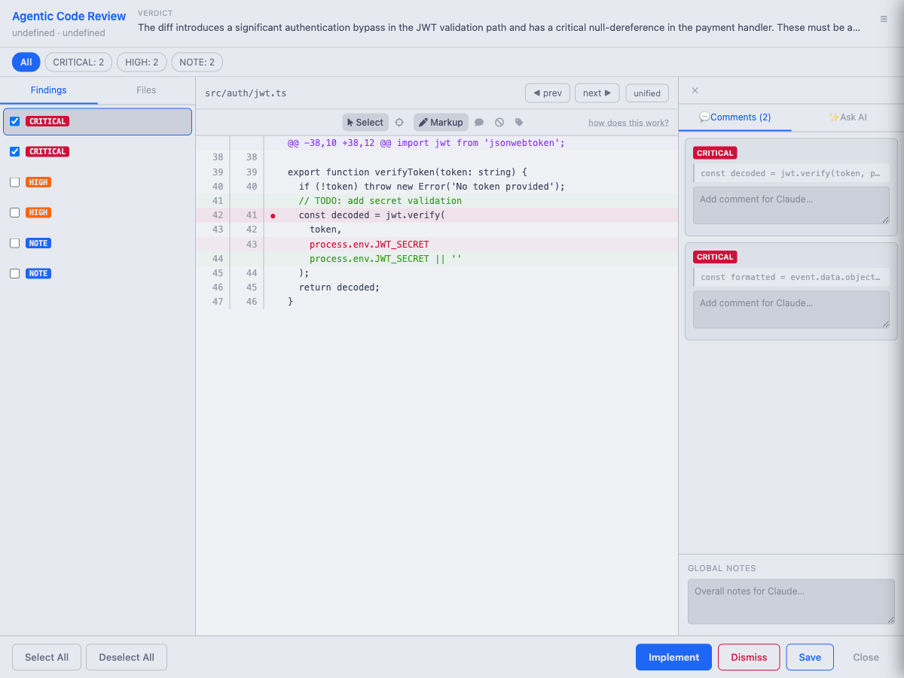
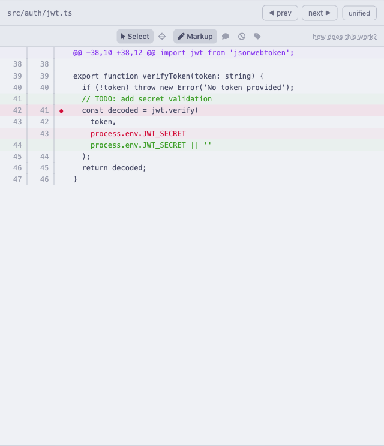
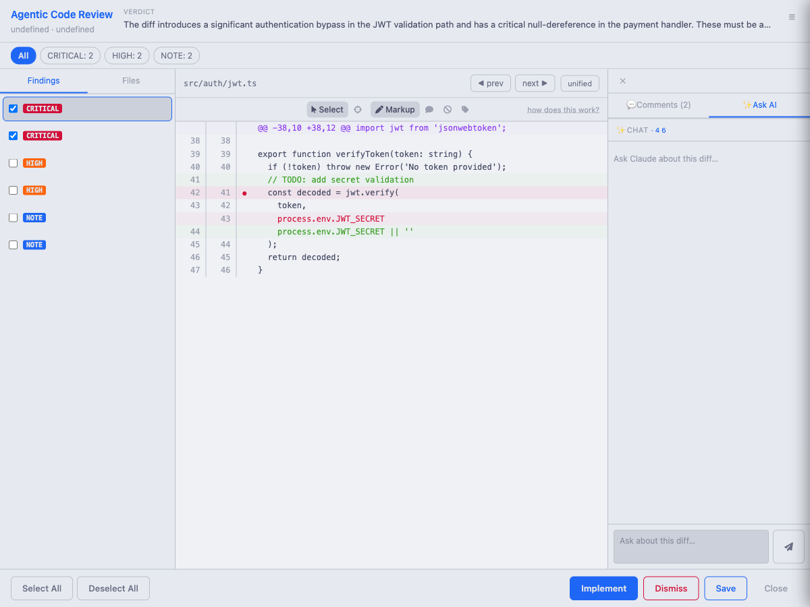

# Agentic Code Reviewer

A portable skill that runs 5 specialized review agents in parallel over your git diff, then an Opus Synthesizer pass that dedupes findings, re-rates them by evidence, and writes a verdict. After the report is printed, a local web UI opens in the browser so you can triage findings, annotate them, and send selected ones back to the agent for implementation. Works on **Claude Code**, **Codex**, and **Copilot CLI**.

## What it does

Five specialist reviewers — semantic, security, architecture, test-coverage, senior-dev — each look at the same `git diff` from their own angle and report only high-confidence findings (≥80). A final Synthesizer pass on Opus takes all five raw outputs, drops anything that can't cite concrete code, merges duplicates, resolves contradictions, re-rates severity by actual blast radius, and writes a 2-sentence top-line verdict.

On Claude Code there's an extra layer: a Stop hook that blocks the session from ending until the review has actually run (with a one-time escape hatch). On Codex and Copilot CLI you invoke the skill manually — see [Claude Code exclusive: session-exit gate](#claude-code-exclusive-session-exit-gate) below.

## The review council

| Agent | Focus | Model |
|---|---|---|
| `semantic-analyzer` | Logic correctness, control flow, null handling, off-by-one, race conditions | Sonnet |
| `security-scanner` | OWASP Top 10, injection, secrets in code, auth/authorization gaps | Sonnet |
| `architecture-reviewer` | Module boundaries, system-level SOLID, missing abstractions, YAGNI | Sonnet |
| `test-coverage-analyzer` | Behavioral test gaps, missing edge cases, untested error paths | Haiku |
| `senior-dev-reviewer` | Local DRY, naming, error handling, project conventions, dead code | Sonnet |
| `synthesizer` (judge) | Dedupe, drop no-evidence findings, resolve contradictions, re-rate severity, write verdict | Opus |

## How it works

1. **Pre-flight.** Guard for being inside a git repo. Run `git diff --text HEAD` (then plain `git diff` as fallback) and filter out lockfiles, minified assets, images, and build directories. If the filtered diff is empty, exit cleanly with `No reviewable changes`. If the diff exceeds 2000 lines or 50 files, print a cost/time warning.
2. **Fan out.** Dispatch all 5 reviewer agents in parallel using your platform's subagent tool (see the [platform matrix](#platform-support-matrix)). Each agent gets the same filtered diff and a strict prompt: report only findings with confidence ≥80, formatted as `[SEVERITY] file:line — finding — reasoning`.
3. **Synthesizer pass.** Send the diff + all 5 raw outputs to the `synthesizer` agent. It applies judge rules (evidence required, semantic dedupe, contradiction resolution, severity re-rated by blast radius, drop speculation) and emits the final report.
4. **Print verdict.** The Synthesizer's output is the final report — Verdict / CRITICAL / HIGH / NOTES / Summary. No further aggregation.
5. **Completion signal.** Touch `/tmp/claude-code-review-${SESSION_ID}.done` and emit `<!-- AGENTIC-REVIEW-COMPLETE -->`. On Claude Code these unblock the Stop hook; on other platforms they are harmless no-ops.
6. **Interactive review UI.** Serialize the findings + per-file diffs to `/tmp/claude-code-review-${SESSION_ID}.json` and launch the compiled `review-server` binary that opens the browser. Three-panel UI: findings list (severity filters), diff viewer (unified/split) with an annotation toolstrip, per-finding comment cards, global notes, and a chat panel for asking Claude questions about the diff. Click **Implement** to send chosen findings back to the agent for implementation, **Save** to write a markdown record to `docs/code-reviews/`, or **Close** to finish. Decision is written to `/tmp/claude-code-review-${SESSION_ID}.decision` for the agent to act on.

## Platform support matrix

| Feature | Claude Code | Codex | Copilot CLI |
|---|---|---|---|
| Parallel subagent fan-out | ✅ | ✅ (requires `multi_agent = true`) | ✅ |
| Skill invocation | `/agentic-code-reviewer` + auto-trigger | skills load natively | `skill` tool |
| Session-exit auto-gate | ✅ | ❌ | ❌ |
| Interactive review web UI | ✅ | ✅ | ⚠ untested |
| Subagent dispatch tool | `Agent` / `Task` | `spawn_agent` | `task agent_type: general-purpose` |

Full tool-name mapping is in [`references/platform-tools.md`](references/platform-tools.md).

## Installation

### Claude Code (primary)

**Option A — one-line install (recommended):**

```bash
curl -fsSL https://raw.githubusercontent.com/putchi/agentic-code-reviewer-skill/main/install.sh | bash
```

Or with an explicit platform flag to skip the prompt:

```bash
curl -fsSL https://raw.githubusercontent.com/putchi/agentic-code-reviewer-skill/main/install.sh | bash -s -- --platform claude
```

**Option B — install from the published repo:**

The repo is a self-hosting marketplace, so register it first, then install the plugin from it:

```
/plugin marketplace add putchi/agentic-code-reviewer-skill
/plugin install agentic-code-reviewer@agentic-code-reviewer-skill
```

**Option C — local clone** (for local development):

```
git clone git@github.com-secondary:putchi/agentic-code-reviewer-skill.git
cd agentic-code-reviewer-skill
./install.sh --platform claude
```

Verify with `/plugin` and confirm `agentic-code-reviewer` is listed.

Required tools: `git`, `python3` (used by the Stop hook to parse hook JSON), `bash`. No runtime required for the review UI — the server binary is self-contained.

### Codex (CLI + App)

**Option A — one-line install (recommended):**

```bash
curl -fsSL https://raw.githubusercontent.com/putchi/agentic-code-reviewer-skill/main/install.sh | bash -s -- --platform codex
```

Or install for both Claude Code and Codex at once:

```bash
curl -fsSL https://raw.githubusercontent.com/putchi/agentic-code-reviewer-skill/main/install.sh | bash -s -- --platform both
```

**Upgrading an existing install:** when the skill is already installed, the installer asks before overwriting. To skip the prompt and force-overwrite both platforms in place, add `--force` (alias: `-y` or `--yes`):

```bash
curl -fsSL https://raw.githubusercontent.com/putchi/agentic-code-reviewer-skill/main/install.sh | bash -s -- --platform both --force
```

`--force` also removes any legacy manual install at `~/.claude/plugins/agentic-code-reviewer/` without asking. If you pass `--force` without `--platform` and Codex is detected, the installer auto-picks `both`.

**Option B — from a local clone:**

```bash
git clone git@github.com-secondary:putchi/agentic-code-reviewer-skill.git
cd agentic-code-reviewer-skill
./install.sh --platform codex
```

After installing, enable multi-agent support — add this to `~/.codex/config.toml`:

```toml
[features]
multi_agent = true
```

Without this, parallel subagent dispatch will fail.

### Copilot CLI

The `install.sh` does not have a Copilot CLI path. Manual install: clone the repo and symlink or copy the directories your Copilot CLI skills loader expects (`skills/agentic-code-reviewer/`, `agents/`, `references/`, `packages/server/`). Tool-name mapping is in [`references/platform-tools.md`](references/platform-tools.md).

```bash
git clone https://github.com/putchi/agentic-code-reviewer-skill.git
```

> ⚠ Copilot CLI support is untested. The review UI ships as a self-contained binary with no external runtime dependency.

## Usage

- **Claude Code**: run `/agentic-code-reviewer`, or let the Stop-hook gate prompt the agent to run it for you when you try to end a session with unreviewed changes.
- **Codex**: skills load natively — tell the agent `run the agentic-code-reviewer skill`.
- **Copilot CLI**: invoke the skill via the `skill` tool: `skill agentic-code-reviewer`.

On every platform, empty diffs exit cleanly (`No reviewable changes — nothing to review.`) and diffs above 2000 lines / 50 files print a cost and timing warning before fanning out.

## Output format

The Synthesizer emits a fixed structure. Severity buckets stay in the report even if empty (they read `_None._`).

```
## Code Review Results

### Verdict
[Two sentences. First: ship-readiness assessment. Second: the single most important issue.]

### CRITICAL
- [CRITICAL] file:line — finding — reasoning — EVIDENCE: `<code excerpt>` (dim: semantic, security, ...)

### HIGH
- [HIGH] file:line — finding — reasoning — EVIDENCE: `<code excerpt>` (dim: architecture, ...)

### NOTES
- [NOTE] file:line — finding — reasoning — EVIDENCE: `<code excerpt>` (dim: senior-dev)

### Summary
- X critical, Y high, Z notes retained; W findings dropped (D no-evidence, M merged, C contradictions resolved).
```

## Interactive review UI

After the Synthesizer prints its report, the skill launches a self-contained binary (`dist/review-server`) that opens the browser. No external runtime is required — the entire React app is embedded in the binary.

### Layout

**Header** — shows branch name, timestamp, and the Synthesizer verdict. The **≡** button opens Settings.

**Filter bar** — one-click severity filters: All / CRITICAL / HIGH / NOTE with per-severity counts.

**Left panel** — two tabs:
- *Findings* — all findings with severity badges and checkboxes. CRITICAL findings are pre-checked. Use `j`/`k` to navigate, `Space` to check/uncheck, `Enter` to jump to the diff.
- *Files* — affected files with per-file finding counts.

**Diff viewer (center)** — unified or split diff view. Annotation toolstrip:
- *Select* — drag to select a range of lines
- *Pinpoint* — click a single line to target it
- *Markup* — highlight selected lines
- *Comment* — select then immediately add a comment
- *Redline* — mark selected lines for deletion
- *Label* — apply a quick severity label to selected lines

**Right panel (collapsible)** — two tabs:
- *Comments* — per-finding comment fields for checked findings, plus a Global Notes field. Everything here is included in the payload sent back to Claude when you click Implement.
- *Ask AI* — chat with Claude about the diff. Configurable model (Sonnet / Opus / Haiku). Annotation toolstrip has a quick-link to pre-fill the chat with context about the selected line.

**Action bar** — bottom bar with:
- *Select All / Deselect All* — bulk check controls
- *Implement* — send checked findings + comments back to the agent for implementation
- *Dismiss* — mark checked findings as dismissed with an optional reason; dismissed findings are excluded from the Implement payload and recorded in the saved markdown
- *Save* — write a markdown review record to `docs/code-reviews/`
- *Close* — finish without action. If there are unaddressed CRITICAL findings, a guard modal asks you to confirm or save first.

**Settings pane** (≡ menu) — chat model selection, auto-close delay, and version display. Settings persist across sessions.

**First-run modal** — shown on first launch to configure chat model and auto-close preference.

**Update toast** — shown when a newer version is available, with a one-click copy of the install command.

### Keyboard shortcuts

| Key | Action |
|-----|--------|
| `j` / `k` | Next / previous finding |
| `Space` | Check / uncheck selected finding |
| `Enter` | Jump to finding's diff |
| `Escape` | Close modal or menu |

## Claude Code exclusive: session-exit gate

This part runs only on Claude Code; it has no Codex or Copilot CLI equivalent.

The Stop hook (`hooks/code-review-gate.sh`) does the following on every Stop event:

- Runs `git diff HEAD` (then `git diff`) to see if any code was changed this session.
- If there are changes **and** `/tmp/claude-code-review-${SESSION_ID}.done` is missing, returns `{"decision":"block"}` with a system message instructing the model to run the skill. It also touches `/tmp/claude-code-review-${SESSION_ID}.blocked`.
- The blocked sentinel is the **one-time escape hatch**: if it already exists, the next Stop is allowed through. You are never held hostage — you can always end the session by trying twice.
- Stale `.done` and `.blocked` sentinels older than 1 day are auto-cleaned on every invocation.
- Backward-compat fallback: if for some reason the `.done` file can't be written, the hook still honors a transcript grep for `AGENTIC-REVIEW-COMPLETE`.

On Codex and Copilot CLI you are responsible for invoking the skill before ending the session.

## What it does NOT do

- Does not auto-fix code unless you explicitly opt in via the interactive review UI's **Implement** action.
- Does not block commits or pushes — only gates the Stop event in the current Claude Code session.
- Does not review binary, lockfile, or build-artifact diffs (filtered out before fan-out).
- Does not report findings below 80% confidence.

## Costs and timing

For a large diff (>2000 lines or >50 files) the run fans out to 5 reviewers + 1 Synthesizer pass and takes roughly **30–90 seconds** at an estimated **~$0.08–$0.25**. Smaller diffs are proportionally cheaper. Only the Synthesizer runs on Opus; 4 reviewers run on Sonnet and 1 (test-coverage) runs on Haiku (see [the review council](#the-review-council)).

## Screenshots

### Full review UI


### Annotation toolstrip and diff viewer


### Ask AI chat panel


## Project layout

```
.
├── .claude-plugin/plugin.json          # Claude Code manifest (version, commands pointer)
├── agents/                             # 5 reviewers + synthesizer (prompts are portable)
│   ├── semantic-analyzer.md
│   ├── security-scanner.md
│   ├── architecture-reviewer.md
│   ├── test-coverage-analyzer.md
│   ├── senior-dev-reviewer.md
│   └── synthesizer.md
├── commands/agentic-code-reviewer.md   # Claude Code slash command
├── docs/
│   ├── code-reviews/                   # Saved markdown reviews (git-ignored)
│   └── screenshots/                    # UI screenshots for README
├── hooks/                              # Claude Code exclusive (Stop-event gate)
│   ├── hooks.json
│   ├── code-review-gate.sh
│   └── check-update.sh
├── packages/
│   ├── shared/                         # @acr/shared — TypeScript types (Finding, Decision, Payload, etc.)
│   ├── server/                         # @acr/server — Bun HTTP server, compiled to self-contained binary
│   └── client/                         # @acr/client — React 19 + Vite + Tailwind 4 SPA, built to single HTML
├── references/
│   └── platform-tools.md              # Claude Code / Codex / Copilot CLI tool mapping
├── scripts/
│   └── capture-screenshots.js         # Playwright screenshot capture for docs
├── skills/agentic-code-reviewer/SKILL.md
├── tests/                             # Bun test runner — unit + parity tests
└── install.sh                          # Installer for Claude Code plugin + Codex skill
```

The server binary is compiled with `bun build --compile`. The built client HTML is statically imported at compile time — the resulting binary is fully self-contained with no runtime dependency on the end-user machine.

## License

MIT — see [LICENSE](LICENSE).
